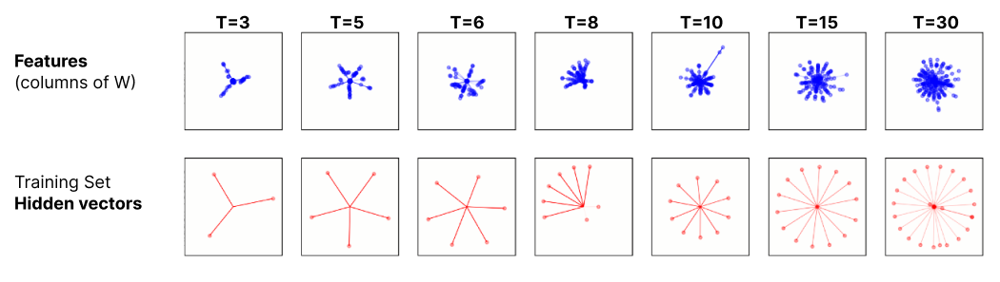
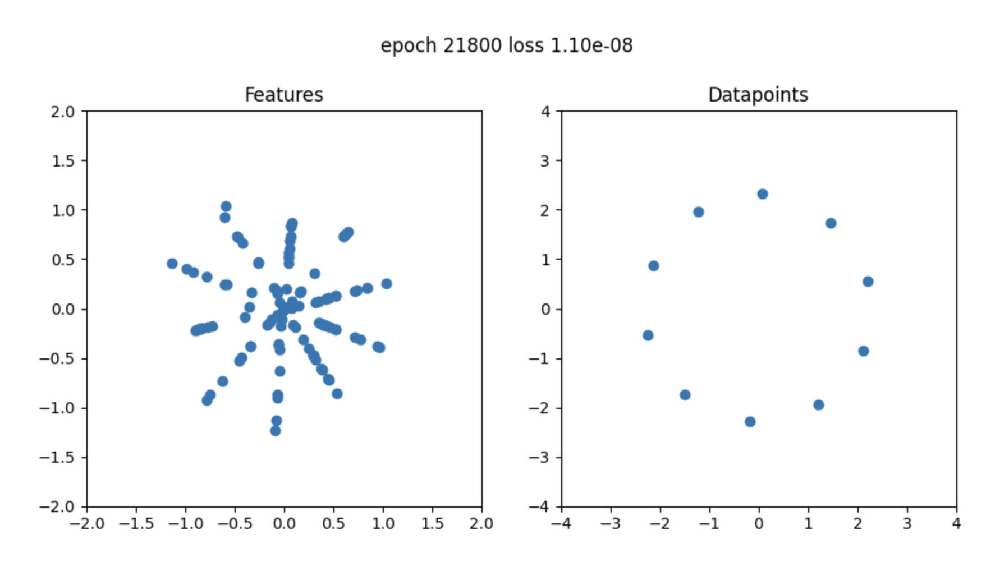
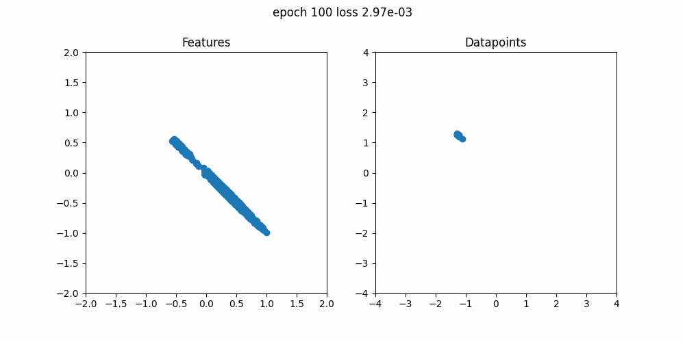
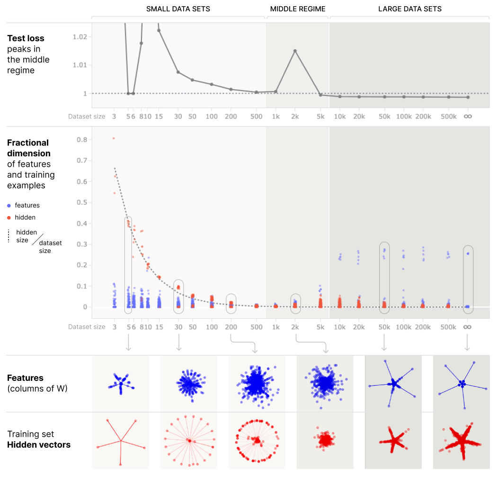

# toy double descent

Reproducing the core of Anthropic's "[Superposition, Memorization, and Double Descent](https://transformer-circuits.pub/2023/toy-double-descent/index.html)" paper.

They found that for limited training sets overfitting can be seen as *datapoints* being in superposition while *features* aren't:

We see the same effect in our reproduction, here for $T=10$:

Here's a cute gif of the evolution over time:

Henighan et. al also demonstrated *double descent*, the difference

We see the same effect in our reproduction, for $T=1000$ and $n*S = 10$ (expected number of features per datapoint) we get:

(TODO: add result. big runs take a long time on my laptop...)

